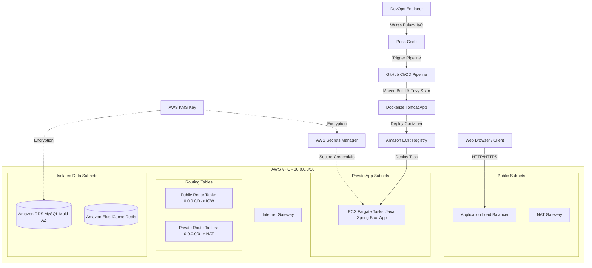

# Implementation Plan - Containerization & Pulumi AWS 3-Tier Infrastructure

This plan outlines the steps to containerize the Java Spring Boot application using Docker, and provision the modernized, highly secure, and scalable 3-tier AWS infrastructure using **Pulumi in TypeScript**.

---

## User Review Required

> [!IMPORTANT]
> **Configuration Strategy:**
> 1. **Docker Base Image:** We will use `tomcat:9.0-jdk8-openjdk-slim` because the Spring Boot project builds a `WAR` file running on Java 8, with Tomcat Jasper v9 dependencies.
> 2. **Environment Configuration:** The application properties will be modified to support runtime environment variables (`DB_HOST`, `DB_USER`, `DB_PASSWORD`), allowing secure connection parameter injections instead of hardcoded strings in `application.properties`.
> 3. **Pulumi Infrastructure Language:** We will use **TypeScript** for the Pulumi IaC configuration as it is highly expressive and the industry standard for modern Cloud IaC.

---

## Open Questions

> [!NOTE]
> Please review and provide feedback on these structural design options:
>
> 1. **Domain Name & SSL Configuration:**
>    * Do you have an active custom domain in AWS Route 53 or another DNS provider?
>    * *Proposed Approach:* The Pulumi stack will default to exposing the Application Load Balancer over HTTP (port 80). We will add commented-out blocks showing how to hook up an ACM (AWS Certificate Manager) SSL/TLS certificate and Route 53 DNS aliases for HTTPS when a domain is available.
> 2. **Environment & Cost Optimization:**
>    * In a strict production environment, NAT Gateways are deployed in *every* public subnet, and RDS is deployed in a *Multi-AZ* configuration. This yields high availability but incurs substantial cost ($150+/month).
>    * *Proposed Approach:* We will write the Pulumi code with configurable parameters (via `pulumi config`) allowing you to easily toggle **High-Availability (Production)** vs **Cost-Optimized (Dev)**. By default, it will provision a single NAT Gateway and a single RDS instance to protect your AWS budget, with switches to easily enable Multi-AZ and multi-NAT.

---

## Proposed Changes

We will organize the changes into two main categories:
1. **Containerization:** The `Dockerfile` and adjustments to the Java app parameters.
2. **Infrastructure as Code (IaC):** The Pulumi stack files inside a new `/infrastructure` directory.



---

### 1. Java-App Containerization

#### [NEW] [Dockerfile](file:///home/the-green/Desktop/Devops%20Project/End-To-End-Deploy-Java-Application-on-AWS-3-Tier-Architecture/Java-App/Dockerfile)
A clean, two-stage Dockerfile:
*   **Stage 1 (Build):** Runs `maven:3.6-jdk-8-slim` to compile, package the `.war` archive, and run tests.
*   **Stage 2 (Runtime):** Utilizes `tomcat:9.0-jdk8-openjdk-slim` for hosting the application.
*   Copies the compiled WAR file as `ROOT.war` inside Tomcat's webapps directory.
*   Exposes Port 8080.

#### [MODIFY] [application.properties](file:///home/the-green/Desktop/Devops%20Project/End-To-End-Deploy-Java-Application-on-AWS-3-Tier-Architecture/Java-App/src/main/resources/application.properties)
*   Refactor database properties to read from environment variables with safe defaults:
    *   `spring.datasource.url = jdbc:mysql://${DB_HOST:localhost}:${DB_PORT:3306}/${DB_NAME:UserDB}?useSSL=false`
    *   `spring.datasource.username = ${DB_USERNAME:root}`
    *   `spring.datasource.password = ${DB_PASSWORD:root}`

---

### 2. Pulumi Infrastructure Stack

We will create a standard Pulumi TypeScript project under a new directory [infrastructure/](file:///home/the-green/Desktop/Devops%20Project/End-To-End-Deploy-Java-Application-on-AWS-3-Tier-Architecture/infrastructure).

#### [NEW] [package.json](file:///home/the-green/Desktop/Devops%20Project/End-To-End-Deploy-Java-Application-on-AWS-3-Tier-Architecture/infrastructure/package.json)
*   Contains Pulumi package dependencies (`@pulumi/pulumi`, `@pulumi/aws`, `@pulumi/awsx` for high-level components, `typescript`).

#### [NEW] [Pulumi.yaml](file:///home/the-green/Desktop/Devops%20Project/End-To-End-Deploy-Java-Application-on-AWS-3-Tier-Architecture/infrastructure/Pulumi.yaml)
*   Defines the Pulumi project name (`aws-java-3tier`) and language (`nodejs`).

#### [NEW] [Pulumi.dev.yaml](file:///home/the-green/Desktop/Devops%20Project/End-To-End-Deploy-Java-Application-on-AWS-3-Tier-Architecture/infrastructure/Pulumi.dev.yaml)
*   Configures default AWS region (`us-east-1`) and project configuration switches (e.g., `costOptimized: true`).

#### [NEW] [tsconfig.json](file:///home/the-green/Desktop/Devops%20Project/End-To-End-Deploy-Java-Application-on-AWS-3-Tier-Architecture/infrastructure/tsconfig.json)
*   TypeScript compiler configurations.

#### [NEW] [index.ts](file:///home/the-green/Desktop/Devops%20Project/End-To-End-Deploy-Java-Application-on-AWS-3-Tier-Architecture/infrastructure/index.ts)
Our primary IaC program defining the resources:
1.  **VPC Networking:** Spans 2 Availability Zones. Configures a Public Subnet, a Private App Subnet, and an Isolated Data Subnet in each zone.
2.  **Security & Roles:**
    *   **KMS Customer Managed Key:** Enforces data-at-rest encryption.
    *   **Secrets Manager Secret:** Securely houses RDS password credentials.
    *   **Security Groups:**
        *   `albSg` (Port 80/443 open to internet).
        *   `ecsSg` (Inbound port 8080 open from `albSg` only).
        *   `rdsSg` (Inbound port 3306 open from `ecsSg` only).
3.  **Application Load Balancer (ALB):** Public ALB directing traffic to the ECS Service target group on port 8080.
4.  **Amazon RDS Multi-AZ Database:** MySQL engine, isolated subnets, automatically loaded credentials from Secrets Manager.
5.  **Amazon ECS & AWS Fargate:**
    *   Creates an ECR repository.
    *   Task definition specifying memory/CPU, Tomcat logs linked to CloudWatch Logs, and environment variables pulling database endpoints and credentials.
    *   Fargate Service attached to target group, enabling scale policies.

---

## Verification Plan

### Automated Verification
*   **Pulumi Dry Run:** Run `pulumi preview` inside the directory to audit resource creation plans.
*   **Docker Build Local Test:** Test compile the container locally:
    ```bash
    docker build -t test-java-app ./Java-App
    ```

### Manual Verification
*   After deploying, verify the ALB Public DNS endpoint (e.g. `http://<alb-dns-name>/home`).
*   Validate the database operations by registering a new employee and performing a successful login.
