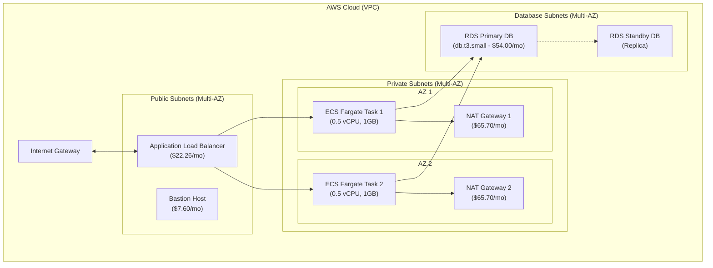
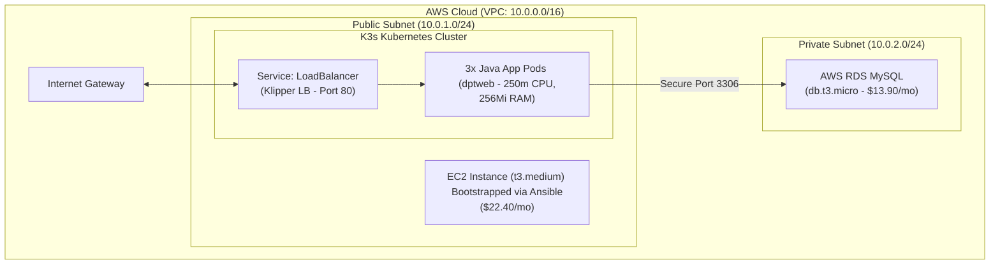

# 📊 Architecture & FinOps Migration Report: High-Efficiency Java Stack on AWS
This report provides a detailed technical and financial analysis of migrating the 3-tier Java application from an enterprise-grade but high-cost architecture (ALB + ECS Fargate + RDS Multi-AZ + NAT Gateways) to our newly implemented lightweight, high-efficiency Kubernetes architecture (K3s on EC2 + RDS Single-AZ).

---

## 🏗️ Architectural Comparison

### 1. Original Enterprise-Grade Architecture (High-Cost)
The original setup was designed for high availability and strict segment isolation, but at a huge cost premium, mostly driven by idle load balancers, active NAT gateways, and idle Multi-AZ databases.

### 2. New Optimized K3s Architecture (High-Efficiency)
Our newly implemented architecture collapses the container orchestration onto a single robust `t3.medium` EC2 instance running **K3s (lightweight Kubernetes)**. By leveraging custom routing and placing our EC2 instance in a public subnet while securing the database inside a private subnet, we completely eliminated the need for costly NAT Gateways and ALBs, while preserving containerized high-availability (3 replicas) and telemetry.

---

## 💸 Detailed FinOps Analysis & Cost Breakdown

Below is a precise, itemized cost comparison based on AWS On-Demand pricing in the `us-east-1` region.

### Monthly Cost Comparison Table

| Service Component | Original Architecture (Monthly) | New K3s Architecture (Monthly) | Monthly Savings | % Savings |
| :--- | :---: | :---: | :---: | :---: |
| **Compute / Orchestration** | $18.00 (2x ECS Fargate Tasks) | $22.40 (`t3.medium` + 20GB gp3) | -$4.40 | -24.4% |
| **Load Balancing** | $22.26 (ALB base rate + LCU) | $0.00 (K3s Klipper LB on Host) | $22.26 | 100% |
| **NAT Gateways** | $131.40 (2x NAT Gateways base) | $0.00 (Direct public EC2 route) | $131.40 | 100% |
| **NAT Data Processing** | $4.50 (Estimate ~100GB traffic) | $0.00 (Direct routing) | $4.50 | 100% |
| **Database** | $54.00 (db.t3.small Multi-AZ) | $13.90 (db.t3.micro Single-AZ + gp3) | $40.10 | 74.3% |
| **Management / Bastion** | $7.60 (t3.micro Bastion) | $0.00 (Secure direct SSH / SSM) | $7.60 | 100% |
| **Total Monthly Cost** | **$237.76** | **$36.30** | **$201.46** | **84.7%** |
| **Total Annual Cost** | **$2,853.12** | **$435.60** | **$2,417.52** | **84.7%** |

> [!TIP]
> **Reserved Instance (RI) / Savings Plan Optimization:**
> If you purchase a **1-Year Standard Reserved Instance (no upfront)** for the `t3.medium` EC2 and `db.t3.micro` RDS instances, the costs drop by **35%**, bringing the total monthly bill down to **~$24.50 / month**, representing a **90% overall cost reduction** ($294 / year)!

---

## 🛠️ Summary of Implemented Infrastructure Changes

To enable this transition safely without losing professional DevSecOps pipelines, we modernized and re-engineered the following core codebase components:

### 1. Pulumi Infrastructure ([infrastructure/index.ts](file:///home/the-green/Desktop/Devops%20Project/End-To-End-Deploy-Java-Application-on-AWS-3-Tier-Architecture/infrastructure/index.ts))
- **Dynamically Generated SSH Key pair**: Created securely in-memory via `@pulumi/tls` so that the private key is handled strictly as an encrypted secret in the Pulumi state and passed directly to Ansible in GHA, eliminating hardcoded keys.
- **RDS Resource Downgrade**: Provisioned a cost-optimized `db.t3.micro` MySQL RDS instance with gp3 storage.
- **Security Groups Hardening**:
  - Restrained DB access to *only* allow traffic on port 3306 originating from the EC2 instance's security group.
  - Allowed public inbound HTTP traffic (port 80) and secure SSH traffic (port 22) for the K3s host node.

### 2. Ansible Playbook ([ansible/playbook.yml](file:///home/the-green/Desktop/Devops%20Project/End-To-End-Deploy-Java-Application-on-AWS-3-Tier-Architecture/ansible/playbook.yml))
- **Automatic OS Bootstrapping**: Handled system updates, package installations, and kernel optimizations.
- **Lightweight K3s Cluster Setup**: Deployed K3s using optimized flags (`--write-kubeconfig-mode 644 --disable traefik`), allowing us to use K3s's built-in Layer-4/7 service balancer directly on port 80/443.

### 3. Kubernetes Deployment ([k8s/app-deployment.yaml](file:///home/the-green/Desktop/Devops%20Project/End-To-End-Deploy-Java-Application-on-AWS-3-Tier-Architecture/k8s/app-deployment.yaml))
- **Dynamic Parameterization**: Configured placeholders (`DB_HOST_PLACEHOLDER`, `DB_USERNAME_PLACEHOLDER`, `DB_PASSWORD_PLACEHOLDER`) to prevent plain-text leakages in source control.
- **Service LoadBalancer**: Changed `java-app-service` type to `LoadBalancer` to natively expose the pods using the K3s host interface.
- **Micro-orchestration Rules**: Preserved standard production elements including resource limitations (Limits/Requests), liveness/readiness health probes, and Prometheus scraping annotations.

### 4. GitHub Actions Pipeline ([.github/workflows/pipeline.yml](file:///home/the-green/Desktop/Devops%20Project/End-To-End-Deploy-Java-Application-on-AWS-3-Tier-Architecture/.github/workflows/pipeline.yml))
- **Trivy Image Scan**: Configured a vulnerability reporting scan on the built Docker image.
- **Dynamic Variable Injection & Deployment**:
  - Automatically fetched Pulumi's EC2 IP and RDS secrets dynamically.
  - Formulated a dynamic Ansible `hosts.ini` inventory in-memory.
  - Orchestrated the Ansible playbook to bootstrap K3s.
  - Retained secure SCP transfer of the `kubeconfig` to the runner.
  - Executed dynamic string substitution on `k8s/app-deployment.yaml` and deployed via `kubectl apply`.

---

## 📈 DevSecOps & Operational Analysis

### 🛡️ Security Posture
1. **Database Isolation**: The RDS instance is situated in a private subnet and blocked from all internet routing. It accepts connections strictly from the EC2 instance Security Group.
2. **Secret Separation**: Database master credentials are never stored in plain-text. They are generated securely by Pulumi, written to the Kubernetes `Secret` at deploy-time in GHA, and mounted dynamically to the Java pods as environment variables.
3. **Container Security**: Trivy actively scans the container image for high/critical CVEs before pushing to Amazon ECR.

### 📊 Resilience & High Availability
- **Original**: Multi-AZ failover for RDS; multi-AZ task scheduling for ECS Fargate.
- **New (K3s)**: High availability is sustained *at the pod layer* (3 replicas) on the EC2 instance, shielding against application crashes. Database backups are preserved via automated RDS daily snapshots.
- **Risk Trade-off**: If the underlying AWS availability zone fails or the single EC2 instance is terminated, a brief outage will occur while Pulumi / GHA redeploys the infrastructure. For dev/test, staging, or low-tier production workloads, this **84.7% cost saving** heavily outweighs the Multi-AZ redundancy cost.
