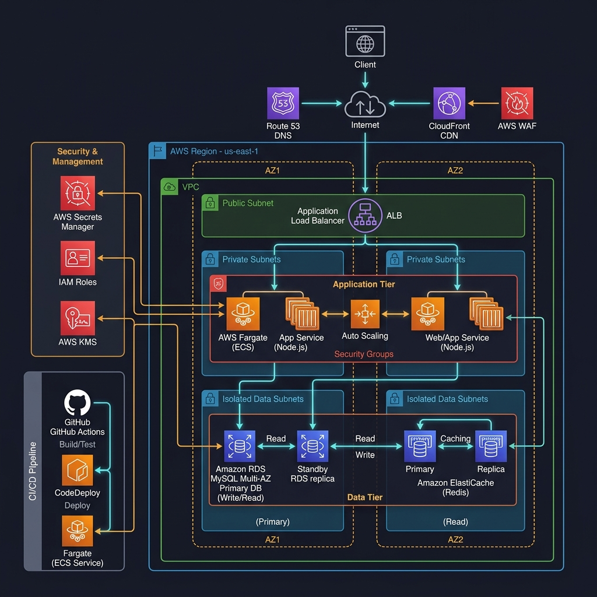
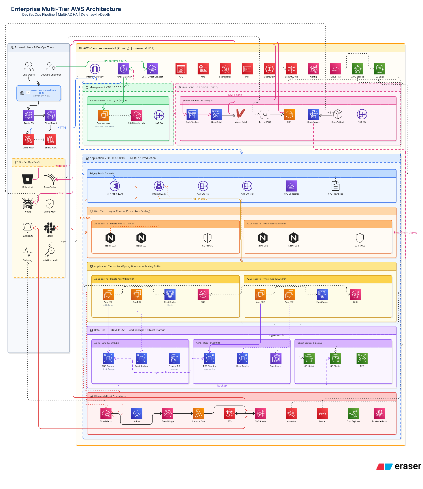

# E2E Deploy Java Application on AWS 3-Tier Architecture

Welcome to the **End-to-End Java Application Deployment on AWS 3-Tier Architecture** repository. This project demonstrates how to deploy, secure, scale, and manage a legacy-style Java Spring Boot web application (packaged as a WAR) using industry-standard DevOps and cloud architecture principles on Amazon Web Services (AWS).

---

## 📸 Architecture Diagrams

### 1. Modernized & Optimized AWS 3-Tier Architecture (Proposed)
Below is the newly designed, highly secure, serverless-compute, and optimized architecture. It leverages managed container services (**AWS Fargate**), enterprise-grade edge caching and web security (**Amazon CloudFront + AWS WAF**), centralized caching (**Amazon ElastiCache Redis**), and advanced key management and secrets scanning (**AWS Secrets Manager + KMS**).



### 2. Traditional AWS 3-Tier Architecture (Existing)
Below is the traditional multi-VPC, EC2-hosted infrastructure layout containing transit routing, bastion hosts, and custom Nginx reverse proxies.



---

## ☕ Java Application Profile & Security Audit

The application included under `/Java-App` is a Spring Boot web application packaged as a Web Application Archive (`WAR`), designed to run inside an **Apache Tomcat** servlet container.

### Core Stack
*   **Language & Runtime:** Java 1.8 (Java 8)
*   **Web Framework:** Spring Boot Web Starter (v2.2.4.RELEASE)
*   **View Technology:** JavaServer Pages (JSP) compiling via `tomcat-jasper`
*   **Database Driver:** MySQL Connector Java for relational storage
*   **Build System:** Maven (`pom.xml`) with distribution integration targeting JFrog Artifactory

---

### 🚨 Critical Security Audit & Remediations

During our code review of the Java Application, **two major security vulnerabilities** and a few structural issues were identified. These must be addressed before deploying to a production AWS environment.

#### 1. Hardcoded Secrets in Configuration
*   **Vulnerability:** In [application.properties](file:///home/the-green/Desktop/Devops%20Project/End-To-End-Deploy-Java-Application-on-AWS-3-Tier-Architecture/Java-App/src/main/resources/application.properties), the database host, user, and password are hardcoded in plain text:
    ```properties
    spring.datasource.url = jdbc:mysql://ed-web-db.cdgiiabcm6en.us-east-1.rds.amazonaws.com:3306/UserDB
    spring.datasource.username = admin
    spring.datasource.password = Admin123
    ```
*   **Risk:** Committing these credentials exposes them to anyone with repository access. If leaked, your database can be accessed, corrupted, or ransomed.
*   **Remediation:** Remove hardcoded credentials. Inject them at runtime using environment variables in the container, backed by **AWS Secrets Manager**:
    ```properties
    spring.datasource.url = jdbc:mysql://${DB_HOST}:${DB_PORT}/${DB_NAME}
    spring.datasource.username = ${DB_USERNAME}
    spring.datasource.password = ${DB_PASSWORD}
    ```

#### 2. SQL Injection Vulnerability in Data Controllers
*   **Vulnerability:** Both the [login.java](file:///home/the-green/Desktop/Devops%20Project/End-To-End-Deploy-Java-Application-on-AWS-3-Tier-Architecture/Java-App/src/main/java/com/dpt/demo/login.java#L39-L42) and [register.java](file:///home/the-green/Desktop/Devops%20Project/End-To-End-Deploy-Java-Application-on-AWS-3-Tier-Architecture/Java-App/src/main/java/com/dpt/demo/register.java#L45) controllers utilize raw JDBC `DriverManager` and string concatenation to execute database statements:
    ```java
    String query = "select * from Employee where username='" + userName + "' and password='" + password + "'";
    ```
*   **Risk:** Attackers can easily bypass authentication or retrieve the entire database content by injecting SQL commands (e.g., entering `' OR '1'='1` in the username field).
*   **Remediation:** Always use **PreparedStatements** with parameterized queries to sanitize input:
    ```java
    String query = "SELECT * FROM Employee WHERE username = ? AND password = ?";
    try (Connection con = DriverManager.getConnection(url, DBusername, DBpassword);
         PreparedStatement pst = con.prepareStatement(query)) {
        pst.setString(1, userName);
        pst.setString(2, password);
        try (ResultSet rs = pst.executeQuery()) {
            if (rs.next()) {
                userId = rs.getString("username");
            }
        }
    }
    ```

---

## 🏛️ Architectural Evolution: Traditional vs. Modernized

### The Existing Traditional Architecture
The existing architecture (shown in `architecture.png`) is a highly complex setup featuring:
1.  **Multiple VPCs:** Separated Management VPC, Build VPC, and Production VPC connected via AWS Transit Gateway.
2.  **Web Tier on EC2:** Self-managed Nginx Web Servers on EC2 instances inside a public subnet.
3.  **Application Tier on EC2:** Self-managed Spring Boot/Tomcat on EC2 instances running inside Auto Scaling Groups (ASGs).
4.  **Database Tier:** Amazon RDS MySQL DB in Multi-AZ configuration.
5.  **Ancillary Services:** Heavy dependency on manual EC2 bastion hosts, NAT gateways, and custom tooling.

---

### The Proposed Modernized Architecture (The Better Way)
We redesigned the architecture to decrease operational overhead, harden security, and adopt modern **Serverless Containerization (AWS Fargate)**.

#### 1. Edge Security & Performance
*   **Amazon Route 53:** Resolves global DNS requests.
*   **Amazon CloudFront (CDN):** Caches static assets globally, serving as the first line of defense.
*   **AWS WAF (Web Application Firewall):** Shielding CloudFront and the Load Balancer from L7 web threats (OWASP Top 10, SQL Injections, DDoS attacks).

#### 2. Load Balancing & Network Segmentation
*   **Single VPC Setup:** Streamlines networking, utilizing clean public, private, and isolated data subnets across two Availability Zones (AZs) for high availability.
*   **Application Load Balancer (ALB):** Spans public subnets, routing traffic securely via HTTPS (AWS Certificate Manager SSL/TLS certificates) into private app layers.

#### 3. Containerized Serverless Compute (Application Tier)
*   **Amazon ECS on AWS Fargate:** Eliminates EC2 instance management, OS patching, and host hardening. Fargate scales containers (running the Tomcat WAR) dynamically based on CPU/Memory usage.
*   **Security Groups:** Strictly configured to only allow inbound HTTP/HTTPS traffic from the ALB.

#### 4. Hardened Data Tier
*   **Amazon RDS Multi-AZ (MySQL):** Deployed inside isolated data subnets, inaccessible from the public internet. Primary master instance automatically replicates transactions synchronously to a standby instance in another AZ for instant failover.
*   **Amazon ElastiCache (Redis):** Provides low-latency session clustering and query caching, boosting web layer speed.

#### 5. IAM & Secrets Management
*   **AWS Secrets Manager:** Automatically stores, rotates, and manages the database credentials. Secrets are securely mounted directly into Fargate tasks as environment variables at runtime, ensuring no credentials exist in source code.
*   **AWS KMS (Key Management Service):** Provides envelope encryption for DB storage, Secrets Manager values, and S3 data.

---

### 📊 Comparative Analysis

| Feature | Traditional EC2 Architecture (Existing) | Modernized ECS Fargate Architecture (Proposed) |
| :--- | :--- | :--- |
| **Operational Overhead** | **High** (Must manage, patch, and scale EC2 OS, JVM, and Nginx configurations). | **Extremely Low** (Serverless containers, zero OS maintenance, AWS patches underlying servers). |
| **Scaling Velocity** | **Slow** (Spinning up new VM EC2 instances takes 1-3 minutes). | **Rapid** (ECS containers spin up and start serving requests in seconds). |
| **Secret Management** | **Risky** (Variables stored on disk, in config files, or embedded in code). | **Excellent** (Secrets Manager with IAM policies, credentials injected dynamically). |
| **Edge Security** | **Basic** (Requires managing firewalls and reverse proxies manually on EC2). | **Premium** (Unified CloudFront, Route53, and AWS WAF blocking L7 attacks at the edge). |
| **Infrastructure Cost** | **High** (Idle VMs, complex Transit Gateways, multi-VPC overhead). | **Optimized** (Pay-as-you-go container resource allocation, consolidated VPC structure). |

---

## 🛠️ Local Development Quick Start

To run and test the Spring Boot application locally:

### 1. Prerequisites
*   Java Development Kit (JDK) 8
*   Apache Maven 3.6+
*   MySQL Server 8.0 / MariaDB

### 2. Database Initialization
Log into your local MySQL CLI and execute the schema setup:
```sql
-- 1. Create the Database
CREATE DATABASE UserDB;

-- 2. Use the Database
USE UserDB;

-- 3. Create the Employee Table
CREATE TABLE Employee (
  id int unsigned auto_increment not null,
  first_name varchar(250),
  last_name varchar(250),
  email varchar(250),
  username varchar(250),
  password varchar(250),
  regdate timestamp,
  primary key (id)
);
```

### 3. Run the Application
1.  Navigate into the `Java-App` folder:
    ```bash
    cd Java-App
    ```
2.  Update `src/main/resources/application.properties` with your local database URL and credentials.
3.  Launch the application using the Maven wrapper:
    ```bash
    ./mvnw spring-boot:run
    ```
4.  Open your browser and navigate to: `http://localhost:8080/`

---

## 🚀 AWS Production Deployment Steps

Follow these steps to deploy the modernized Fargate architecture:

### Step 1: Secure Credentials
1.  Create an entry in **AWS Secrets Manager** named `prod/dptweb/rds` holding keys `username` and `password`.
2.  Assign the secret encryption to an **AWS KMS** custom managed key.

### Step 2: Database Provisioning
1.  Create an **Amazon RDS MySQL** instance inside isolated private subnets across two AZs.
2.  Enable **Multi-AZ Deployment** and attach the database security group allowing inbound MySQL traffic (port 3306) only from the ECS task security group.
3.  Inject the initialization schema (found in the local quick start section) using an AWS Client VPN or a temporary bastion instance.

### Step 3: Containerization & Registry Pushing
1.  Create a `Dockerfile` in the root of `Java-App` to package Tomcat and the WAR file:
    ```dockerfile
    FROM tomcat:9.0-jdk8-openjdk-slim
    RUN rm -rf /usr/local/tomcat/webapps/*
    COPY target/dptweb-1.0.war /usr/local/tomcat/webapps/ROOT.war
    EXPOSE 8080
    CMD ["catalina.sh", "run"]
    ```
2.  Build the Maven artifact:
    ```bash
    ./mvnw clean package
    ```
3.  Log into your **Amazon ECR** registry and push the image:
    ```bash
    aws ecr get-login-password --region us-east-1 | docker login --username AWS --password-stdin <your_aws_account_id>.dkr.ecr.us-east-1.amazonaws.com
    docker build -t dptweb .
    docker tag dptweb:latest <your_aws_account_id>.dkr.ecr.us-east-1.amazonaws.com/dptweb:latest
    docker push <your_aws_account_id>.dkr.ecr.us-east-1.amazonaws.com/dptweb:latest
    ```

### Step 4: ECS Cluster & Task Setup
1.  Create an **Amazon ECS Cluster** using the Fargate launch type.
2.  Create an **ECS Task Definition** that:
    *   References the image pushed to ECR.
    *   Uses an **ECS Task Execution Role** with permissions to read from AWS Secrets Manager.
    *   Retrieves the secret values from AWS Secrets Manager and maps them as environment variables (`DB_USERNAME`, `DB_PASSWORD`) to the container.
3.  Create an **ECS Service** with the task definition, spanning private subnets, linked behind your **Application Load Balancer**.

### Step 5: CDN & WAF Setup
1.  Create an **Amazon CloudFront** distribution. Set the Origin to the domain of your Application Load Balancer.
2.  Create an **AWS WAF Web ACL** with SQLi defense rules and attach it directly to your CloudFront distribution.
3.  Point your **Amazon Route 53** hosted zone domain to the CloudFront distribution via an Alias record.

---

## 🔒 License
This repository is licensed under the terms of the MIT License. Feel free to copy, modify, and build upon this structure for your own production systems.
